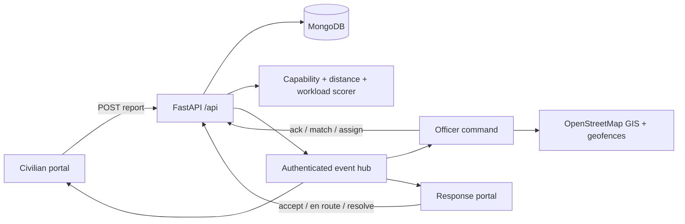

# KIIT Safety Connect — Web-Shooter Dispatch

## 1. Problem and vision

**Problem statement:** “When something goes wrong, how does the right hero end up there fastest?” The system must connect incidents to available security services in real time, coordinate who responds, and ensure nothing falls through the cracks even when multiple people or teams could respond.

KIIT Safety Connect turns that question into one accountable loop: **report → validate → match → accept → respond → resolve**. Civilians and students use a simple mobile-ready reporting portal. The control room receives each incident through a live event stream, sees GIS context, and compares explainable response-team recommendations. Selected teams receive the assignment immediately, acknowledge it, share availability/location, update their journey, communicate with the reporter/control room, and close the incident with a complete audit timeline.

## 2. Users and core journeys

### Civilian / student
1. Self-registers; privileged roles cannot be selected during signup.
2. Reports title, category, severity, description, named location, map coordinate, optional contact, and photo filename.
3. Sees the report appear immediately with a `NEW` event.
4. Receives live status updates and uses the incident channel for safe operational communication.
5. Sees the final resolution without calling or refreshing the page.

### Control-room officer
1. Uses a verified officer account.
2. Sees all reports in the event-driven queue, prioritized with severity and state cues.
3. Acknowledges a report, then reviews response-team recommendations.
4. Assigns one or many teams and designates a primary responder.
5. Can escalate an unacknowledged dispatch back into the matching queue.
6. Uses the Bhubaneswar/KIIT GIS, hotspot matrix, geofences and incident channel alongside live dispatch.

### Response team
1. Uses a verified team account bound to one response-team profile.
2. Controls `AVAILABLE` / `OFF_DUTY` state and can update live location.
3. Sees only incidents assigned to that team.
4. Confirms `TEAM_ACCEPTED`, then `EN_ROUTE`, and finally `RESOLVED`.
5. Opens directions and shares operational updates through the incident channel.

## 3. Dispatch intelligence

Every candidate team receives an explainable score from four factors:

- **Capability match (50 points):** category appears in the team’s capability list.
- **Proximity (up to 30 points):** Haversine distance from current team coordinates to incident coordinates.
- **Workload (up to 20 points):** fewer active assignments improves the score.
- **Availability penalty:** busy/off-duty teams are ranked below available teams.

The officer sees score, distance, availability, workload, and capability match rather than an opaque answer. Multiple teams can be selected when overlapping skills are useful, while one primary responder remains accountable. Team acceptance creates a positive handoff. If a team does not acknowledge, the officer’s escalation action releases the previous teams and returns the report to matching.

## 4. Real-time and reliability design

FastAPI exposes a cookie-authenticated Server-Sent Events stream. Incident creation, assignment, state transitions, messages, team availability and location changes publish lightweight refresh events without exposing PII in the event payload. Each role’s TanStack Query cache is invalidated instantly. A slower polling interval remains as fallback if the event channel is interrupted, and the UI visibly reports `Event stream live` or `Polling fallback`.

MongoDB holds users, revocable sessions, reports, team profiles, messages, geofences and audit timelines. Every mutation is server-authorized by stored role; frontend routing is only a usability layer. Reporter data is scoped to the reporter, team data to assigned teams, and officers to the global queue.

## 5. Architecture

**Frontend:** React 19, strict TypeScript, Vite, Tailwind v4, shadcn/base-ui, TanStack Query, React-Leaflet, Motion.

**Backend:** FastAPI, Pydantic v2, Motor/PyMongo indexes, PBKDF2 password hashing, HTTP-only sessions, SSE.

**Mapping:** key-free OpenStreetMap tiles with visible attribution, Bhubaneswar/KIIT landmarks, incident hotspots and persistent patrol polygons.

## 6. Security and privacy

- Civilian signup always writes the `CIVILIAN` role; officer/team roles are provisioned separately.
- Login portal selection is checked against the stored server-side role.
- Passwords are PBKDF2-hashed; privileged seed passwords are read from environment values, not application source.
- Sessions use HTTP-only, `Secure`, SameSite=Lax cookies and are revoked on logout.
- Login attempts are throttled per IP/email window.
- CORS is allowlisted; wildcard credentialed origins are removed.
- CSP, anti-framing, MIME-sniffing, referrer and permissions headers are set.
- Incident/geofence/message routes enforce object-level authorization.
- The retired exposed demo officer account is removed during secure seeding.

## 7. Data and prototype boundaries

KIIT/Bhubaneswar historical hotspot overlays and risk values are **representative demo data**, not official incident records. User-created reports, role boundaries, assignments, messages, status transitions and geofences are real persistent app flows. The photo field currently records the selected filename as a safe placeholder; no binary file is uploaded. Public OpenStreetMap tiles are suitable for a hackathon demonstration; a production launch should use an SLA-backed OSM-derived provider.

## 8. Edge cases demonstrated

- Multiple suitable teams can be selected; one remains primary.
- Busy/off-duty teams lose recommendation score.
- Simultaneous reports remain independent in the live queue.
- Wrong portal selection is rejected by the backend.
- Civilians cannot list teams or alter incident status.
- Teams cannot access reports that were not assigned to them.
- Unacknowledged assignments can be escalated and rematched.
- Loss of the event channel degrades to polling instead of losing updates.

## 9. Running and judging

The public preview is `https://kiit-incidents.preview.emergentagent.com`. The strongest demonstration is a three-browser flow: a civilian submits a high-severity security report; the officer acknowledges it and shows the scored hero options; Security Alpha accepts, moves en route, posts an update and resolves; the civilian view updates live. Then show fallback escalation, the GIS hotspot map, and a saved geofence risk comparison.

## 10. Future production roadmap

1. Push notifications/SMS for background responders.
2. Encrypted object storage and malware scanning for evidence uploads.
3. SLA-backed map tiles, audited agency identity provisioning, MFA and password reset.
4. Durable multi-instance event broker (Redis/NATS) instead of an in-process hub.
5. Incident priority aging, supervisor overrides, shift scheduling and post-incident reports.